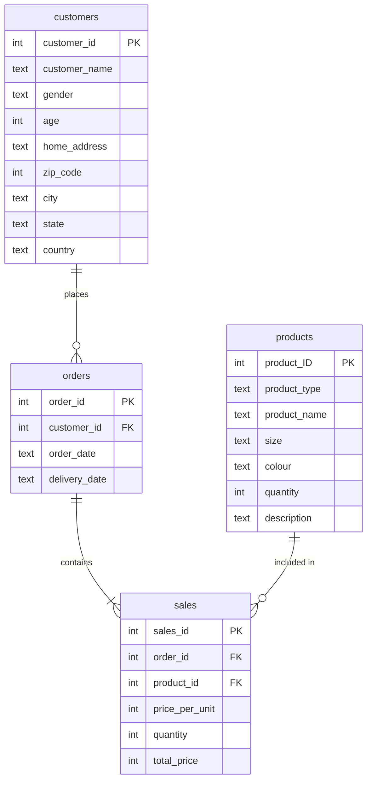

# 🛍️ E-Commerce Analytics Dashboard

Welcome to the **E-Commerce Analytics Dashboard**! This project provides a comprehensive, interactive Streamlit application for exploring and analyzing e-commerce sales, customer demographics, and product performance.

## 🌟 Features
- **Premium User Interface:** A modern, dark-themed dashboard with glassmorphism effects, gradient typography, and fully responsive KPI cards.
- **Interactive Visualizations:** High-quality charts powered by Plotly, including revenue trend lines, sales distribution donuts, demographic bar charts, and price-quantity scatter plots.
- **Dynamic Filtering:** Filter data across multiple dimensions (Date Range, Product Category, Region/State, and Gender) to generate hyper-specific insights.
- **AI-Generated Insights:** Automatic text summaries highlighting top-performing categories, leading regions, and average order values based on your current filter selections.
- **Data Explorer:** Dig into the raw data using sortable, paginated, and color-coded dataframes, with the ability to export your filtered dataset as a CSV.
- **Optimized Performance:** Utilizes Streamlit's `@st.cache_data` for lightning-fast data loading and manipulation.

## 📂 Project Structure

The project relies on a central data file and a multi-page Streamlit application structure:

- `Cleaned_df.csv`: The cleaned, consolidated dataset containing merged information about customers, products, orders, and sales.
- `EcommDB.sql`: A MySQL dump representing the original relational structure of the data.
- `Home.py`: The main executive dashboard containing KPI metrics, revenue trends, and key insights.
- `pages/Dashboard.py`: Detailed analytics focusing on sales metrics and customer analysis.
- `pages/Marketing Report.py`: A specialized report focusing on top-performing products by city and date range.
- `pages/Univariate Analysis.py`: A deep dive into the distributions of individual numerical and categorical features within the dataset.

## 🗄️ Database Schema

The original relational database (`EcommDB.sql`) consists of four primary tables: `customers`, `orders`, `products`, and `sales`. 

Below is the Entity-Relationship (ER) diagram representing the schema:



## 🚀 Getting Started

### Prerequisites
Make sure you have Python 3.8+ installed along with the following libraries:
- `streamlit`
- `pandas`
- `plotly`

You can install them via pip:
```bash
pip install streamlit pandas plotly
```

### Running the App
1. Clone or download this repository.
2. Ensure the `Cleaned_df.csv` file is in the root directory.
3. Open your terminal or command prompt, navigate to the directory, and run:
   ```bash
   streamlit run Home.py
   ```
4. Streamlit will automatically open the dashboard in your default web browser (typically at `http://localhost:8501`).

